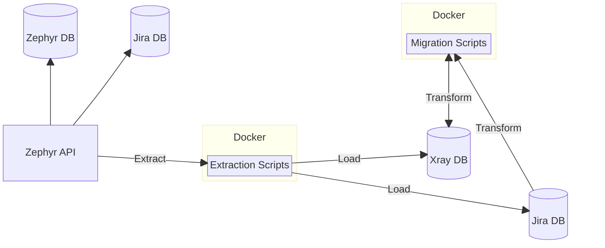
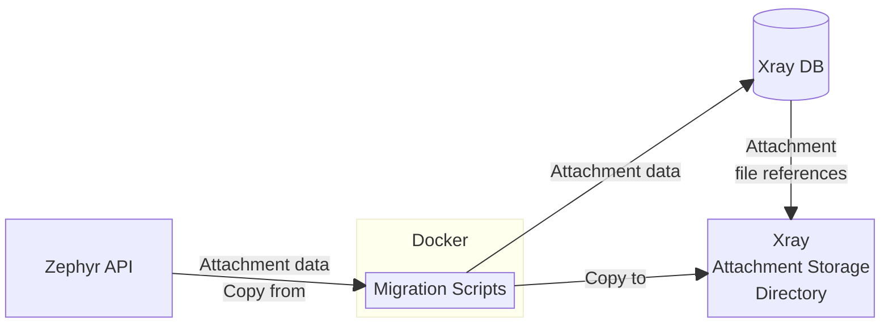

# Zephyr Scale → Xray Migration

## Table of Contents
- [Overview](#overview)
- [Migration Process](#migration-process)
  - [Multiple Jira Instance Migration](#multiple-jira-instance-migration)
  - [Single Jira Instance Migration](#single-jira-instance-migration)
  - [Zephyr Scale to Xray Entities Mapping](#zephyr-scale-to-xray-entities-mapping)
- [Migration Requirements & Pre-requisites](#migration-requirements--pre-requisites)
  - [Attachment requirements](#attachment-requirements)
- [Migration Limitations](#migration-limitations)
  - [Limitations from Xray and Jira](#limitations-from-xray-and-jira)
  - [Limitations from the migration process](#limitations-from-the-migration-process)
  - [Possible limitations from AWS EC2](#possible-limitations-from-aws-ec2)
- [Migration Usage](#migration-usage)
  - [Docker and GitHub repository preparation](#docker-and-github-repository-preparation)
  - [Container setup](#container-setup)
  - [Migration configuration](#migration-configuration)
  - [Xray Configuration](#xray-configuration)
  - [Zephyr Scale Configuration](#zephyr-scale-configuration)
  - [Migration (Extract-Load)](#migration-extract-load)
  - [Restart and re-index Jira server](#restart-and-re-index-jira-server)
  - [Reconciliation reporting](#reconciliation-reporting)
- [Additional Information](#additional-information)
  - [Start and setup script](#start-and-setup-script)
  - [Cleaning migrated data](#cleaning-migrated-data)
  - [Cleaning extracted data](#cleaning-extracted-data)
  - [Stopping the Docker container](#stopping-the-docker-container)
  - [Removing the Docker container](#removing-the-docker-container)
  - [Additional commands](#additional-commands)
  - [Checking the status of the containers](#checking-the-status-of-the-containers)
  - [Windows as the Jira destination](#windows-as-the-jira-destination)
    - [Install and configure OpenSSH server on Windows](#install-and-configure-openssh-server-on-windows)

## Overview

This repository contains configuration files and scripts to migrate data from SmartBear's [Zephyr Scale](https://smartbear.com/test-management/zephyr-scale/) to [Xray](https://www.getxray.app/). The migration retrieves data via the Jira and Zephyr Scale APIs, then writes directly to the Jira and Xray database. The migration ELT (Extract-Load-Transform) process uses [Docker](https://docker.com) containers and data transformation scripts, to move data from Zephyr Scale to Xray.

The migration copies the specified Zephyr Scale projects from a Jira instance to Xray projects on either the same or a different Jira instance.



## Migration Process

There are 3 primary factors when considering migrating data from Zephyr Scale to Xray.

1. Is the source and the target on the same Jira instance, or a different instance?
2. Does the target project already exist in Jira, or is it a new project?
3. If it is an existing project, is the target project already an Xray project?

This means there are 6 possible cases, as seen in this table.

|                | New Target Project                | non-Xray Target Project                   | Existing Xray Target Project                           |
|:---------------|:----------------------------------|:------------------------------------------|:-------------------------------------------------------|
| Same Jira      | new Xray project / same Jira      | convert non-Xray project / same Jira      | migrate data to existing Xray project / same Jira      |
| Different Jira | new Xray project / different Jira | convert non-Xray project / different Jira | migrate data to existing Xray project / different Jira |

### Multiple Jira Instance Migration


### Single Jira Instance Migration

There is also a simpler case for migrating between Zephyr Scale and Xray on the same Jira instance.


### Zephyr Scale to Xray Entities Mapping

The table below illustrates the mappings between Zephyr Scale and Xray.

| Zephyr                  | Xray            | Notes                                                                                      |
|:------------------------|:----------------|:-------------------------------------------------------------------------------------------|
| Project                 | Project         |                                                                                            |
| User                    | User            |                                                                                            |
|                         |                 |                                                                                            |
| CUSTOM FIELDS           |                 |                                                                                            |
| Test Case Custom Field  | Custom Field    |                                                                                            |
| Test Plan Custom Field  | Custom Field    |                                                                                            |
| Test Cycle Custom Field | Custom Field    |                                                                                            |
|                         |                 |                                                                                            |
| ENTITIES                |                 |                                                                                            |
| Test Case               | Jira Issue      |                                                                                            |
| Test Cycle              | Jira Issue      |                                                                                            |
| Test Run                | Test Run        | The destination table is (project key)_`TEST_RUN` (e.g. `AO_ABC123_TEST_RUN`) in Xray.     |
| Test Plan               | Jira Issue      |                                                                                            |
|                         |                 |                                                                                            |
| ATTACHMENTS             |                 |                                                                                            |
| Test Case Attachments   | File Attachment |                                                                                            |
| Test Cycle Attachments  | File Attachment |                                                                                            |
| Test Run Attachments    | Attachment      | The destination table is (project key)_`ATTACHMENT` (e.g. `AO_ABC123_ATTACHMENT`) in Xray. |
| Test Plan Attachments   | File Attachment |                                                                                            |

## Migration Requirements & Pre-requisites

1. The Jira instance(s) that are the source and the target of the migration must be already setup and running.
1. macOS or Linux are recommended for the computer running the migration. The migration automation bash scripts in this repository configure and execute the Docker-based migration tooling, and require a [Unix-like](https://en.wikipedia.org/wiki/Unix-like) operating system that is capable of running bash scripts.

> [!TIP]
> [Windows PowerShell](https://learn.microsoft.com/en-us/powershell/) with [Windows Subsystem for Linux (WSL)](https://learn.microsoft.com/en-us/windows/wsl/install) should suffice, if it is the only option, but it has not been tested.

3. Install [Git](https://git-scm.com/) on the computer running the migration.
1. Install [Docker](https://docs.docker.com/get-docker/) and docker-compose (which is included with [Docker Desktop](https://www.docker.com/products/docker-desktop/)) on the computer running the migration.
1. Allocate at least 16 gigabytes (GB) of RAM for running the Docker containers. The Docker default is 50% of the computer's RAM, so the default is sufficient on a computer with 32GB+ of RAM. You can adjust the amount of memory allocated to Docker from the [Docker Desktop settings](https://docs.docker.com/desktop/settings/mac/#advanced).

6. Verify that the computer running the migration has access to the Postgres database of the Jira instance that is the target of the migration. You will need:
  - the Jira database host
  - the [Postgres](https://www.postgresql.org/) port (e.g. `5432`)
  - the name of the Jira database (e.g. `jiradb`)
  - the Jira database username (e.g. `jira_user`)
  - the password for the Jira database user
7. Ensure you have a spreadsheet application that is capable of viewing `.xlsx` files, such as MS Excel, Apple Numbers, Google Sheets, or LibreOffice.

### Attachment requirements



You will need to provide the path to the Xray attachment file storage location, where attachment files will be copied during the migration.

You can choose to copy migrated attachments remotely to the target Xray instance using SSH File Transfer Protocol (SFTP), or you can just copy them locally if this migration is running on the target Xray instance, or if you have a network mount available.

During the migration process, the Zephyr Scale attachment files will be copied to the Xray attachment storage location.

## Migration Limitations

### Limitations from Xray and Jira

There are a few limitations of the migration caused by Xray's use of Jira for storing certain entities.

1. You can only migrate up to 3 step custom fields: Jira allows only up to 6 custom fields on case steps but 3 are already in use (they are step, data and expected results).
1. You can have migrate up to 12 test run custom fields: Jira allows only up to 12 custom fields on test runs.
1. Test cycle folders: test cycle folders don't really have a use in Xray, so they are not migrated.
1. Test plans folders: test plans folders are migrated, but they serve a different purposes in Xray. They are still collections of test cases, instead of plans, even if they collect test cases inside the same plan.
1. Multi-line string custom fields: these custom fields in Jira don't support markdown or HTML formatting. Even if the content is migrated as markdown text, so as to not lose any of the formatting, some things in the markdown won't be rendered, like attachments. Links are automatically formatted to be clickable in Jira. This is valid for Test, Test Execution and Test Plan custom fields (since they are Jira fields). Test Runs do support markdown since they are Xray fields.
1. In Zephyr Scale, all 3 script types (PLAIN_TEXT, BDD, STEP_BY_STEP) can have actual results. Instead Xray only have the actual results for STEP_BY_STEP scripts. So the actual results for the other scripts are not migrated.
1. For PLAIN_TEXT scripts, in Zephyr Scale the script can contains attachments. In Xray, that's a simple text field, so images are not supported. Any inline attachments are migrated as Test attachments instead.

### Limitations from the migration process

When migrating from one Jira instance to another - rather than migrating from Zephyr Scale to Xray on the same Jira instance - the migration has the ability to migrate the attachments directly into the target Jira instance if the SSH connection details are provided. For this you need to provide a user that has permissions above or at least equal to the Jira user created during the installation.

### Possible limitations from AWS EC2

If you are using AWS EC2 instances as the Jira source and/or target, and they are inside the same VPC of an EC2 instance that is running this migration process, you might want to disable the [source/destination check](https://docs.aws.amazon.com/AWSEC2/latest/UserGuide/using-eni.html#change_source_dest_check) for the network interfaces of your source and destination instances. You can do that from the AWS EC2 console: select the instance, click on "Actions", then click on "Networking", then on "Change source/destination check". In the dialog that appears make sure "Stop" is selected and save.

## Migration Usage

### Docker and GitHub repository preparation

1. Clone [this GitHub repository](https://github.com/Xray-App/xray-zephyr-migration) if you haven't already, with this command:

```console
git clone git@github.com:xray-app/xray-zephyr-migration
```

2. Log in to GitHub, and from [settings](https://github.com/settings/tokens), click "Generate new token" and generate a (classic) personal access token (PAT). You must provide a token name, such as `Xray migration`, an expiration, and the following scope:
  - `read:packages`

3. Click the green "Generate token" button.
1. Be sure to copy and save the personal access token once you've generated it.
1. Use the following command to log in to the [GitHub Container Registry](https://docs.github.com/en/packages/working-with-a-github-packages-registry/working-with-the-container-registry) (GHCR) with your username and the PAT you just generated:

```console
export GHCR_PAT=<insert personal access token here>
export GHCR_USER=<insert GitHub username here>
echo $GHCR_PAT | docker login ghcr.io -u $GHCR_USER --password-stdin
```

6. Look for the `Login Succeeded` message. Now that you are logged in, you'll be able to pull the `xray-zephyr-migration` image from GHCR, by following the steps in the next section.

### Container setup

1. Start the Docker container download and setup with the following commands:

```console
cd xray-zephyr-migration
./run.sh start
```

2. The script begins by pulling the `xray-zephyr-migration` image from the GHCR.
1. After the image is pulled, you should see the following message:

```console
You can choose to copy migrated attachments remotely to the target Jira/Xray instance using SSH File Transfer Protocol (SFTP), or you can just copy them locally if this migration is running on the target Jira/Xray instance, or if you have a network mount available.
```

and the following prompt:

```console
Will you be using SFTP to copy migrated attachments remotely to the target Jira/Xray instance machine? (y/n)
```

Enter 'y' if you will be using SFTP, or 'n' if you will be copying attachments locally.

If you are not using SFTP, you will additionally be prompted for the path to the Xray attachment storage location. Enter the filepath where you want to store the migrated attachment files on the target Xray instance.

If the path you enter does not already exist, you can choose to have it created by entering 'y', or you can enter 'n' to cancel and enter a different path.

4. Three new directories will be created in your local copy of this repository:
- `/config` - Contains configuration files for Zephyr Scale and Xray.
- `/logs` - Log files generated by the migrations you run will be stored here.
- `/reports` - Any migration reconciliation reports you generate will be stored here.
5. If any of these directories already exist, they won't be modified by the script.
1. Once you see the messages `Starting...` and `xray-zephyr-migration`, the setup script is complete.
1. To check the status of the Xray Zephyr Docker container, run the following command:

```console
./run.sh status
```

8. The container should have a status of `running`. You are now ready to configure the migration.

### Migration configuration

Run the following command to configure settings for Zephyr Scale and Xray:

```console
./run.sh configure
```

> [!TIP]
> Note: you can edit the Zephyr Scale configuration directly by editing the `conn:` key of `./config/zephyr/zephyr-config.yml`

Follow the steps below at each prompt to complete the configuration:

_Zephyr_

1. Enter the keys of the Zephyr Scale projects to migrate, separated by commas (e.g. `PROJ123,PROJ456`).
1. Enter the domain of the Zephyr Scale server hosting the API, including the port if necessary (e.g. `https://your-zephyr-domain.com:8443`).
1. Enter the Jira user name to use for the Zephyr Scale API. Leave this blank if you are using a bearer token for authentication.
1. Enter the Jira user password to use for the Zephyr Scale API user. Leave this blank if you are using a bearer token for authentication.
1. Optionally enter the Zephyr Scale bearer token to use for API authentication, or just press enter if you are using user/password.

_Xray_

1. Enter the Xray database host URL (e.g. `localhost` or `your-xray-domain.com`).
1. Enter the Xray postgres database port (e.g. `5432`).
1. Enter the name of the Jira/Xray database (`jiradb` by default).
1. Enter the database user name to connect to the Jira/Xray database (`jirauser` by default).
1. Enter the database user password for the Jira/Xray database.

Once done, you should see the message `Excellent, your Xray Zephyr Docker is now configured!`.

Next, check the Xray config at `./config/xray/xray-config.yml` and Zephyr Scale config at `./config/zephyr/zephyr-config.yml` for the updated settings. You can modify these files directly to make any needed changes.

For an in-depth explanation of the settings within the configuration files, refer to the [Xray](./Docs/xray-configuration.md) and [Zephyr Scale](./Docs/zephyr-configuration.md) configuration documentation.

### Xray Configuration

NOTE: If you need to reset the Xray configuration to its default values at any point, you can do so by running the following command:

```bash
git restore data-engineering/config/xray/xray-config.yml
```

#### Configuration Options

`project_name_prefix` - Specify the prefix to be added to the project name to avoid conflicts with existing projects in Xray.

Example:
```yml
project_name_prefix: "Zephyr"
```

`project_name_suffix` - Specify the suffix to be added to the project name to avoid conflicts with existing projects in Xray.

Example:
```yml
project_name_suffix: "Xray"
```

`project_key_suffix` - Specify the suffix to be added to the project key to avoid conflicts with existing project keys.
Example:
```yml
project_key_suffix: "X"
```

`jira_data_path` - Specify the path to the Jira attachment data directory on the remote server.

Example:
```yml
jira_data_path: /var/atlassian/application-data/jira/data/attachments/
```

#### SSH Options

The following options should be added to the `ssh` section of the `xray-config.yml` file.

Example:
```yml
ssh:
  host: ssh.example.com
  username: user
  password: password
```

`host` - Specify the hostname of the remote server.

Example:
```yml
host: ssh.example.com
```

`username` - Specify the username to access the remote server.

Example:
```yml
username: user
```

`password` - Specify the password of the previously specified user to access the remote server.

Example:
```yml
password: password
```

#### Database Options

The following options should be added to the `db` section of the `xray-config.yml` file.

Example:
```yml
db:
  host: jira-database-instance.com
  port: 5432
  database: jiradb
  username: jirauser
  password: jirapassword
```

`host` - Specify the hostname of the database server.

Example:
```yml
host: jira-database-instance.com
```

`port` - Specify the port number of the database server.

Example:
```yml
port: 5432
```

`database` - Specify the name of the database.

Example:
```yml
database: jiradb
```

`username` - Specify the username to access the database.

Example:
```yml
username: jirauser
```

`password` - Specify the password of the previously specified user to access the database.

Example:
```yml
password: jirapassword
```

### Zephyr Scale Configuration

NOTE: If you need to reset the Zephyr configuration to its default values at any point, you can do so by running the following command:

```bash
git restore data-engineering/config/zephyr/zephyr-config.yml
```

#### Configuration Options

`project_keys` - Specify the list of Zephyr projects to be migrated by adding their respective project keys as an array.

Example:
```yml
project_keys: ["PK1", "PK2"]
```

`test_case_statuses_map` - Specify how Zephyr test case statuses should be mapped to Xray issue statuses.

Example:
```yml
test_case_statuses_map:
  Approved: Open
  Deprecated: Closed
  Draft: Open
```

If the status is not found in the `test_case_statuses_map`, the `default_test_case_status` will be used.

Example:
```yml
default_test_case_status: Open
```

`test_plan_statuses_map` - Specify how Zephyr test plan statuses should be mapped to Xray issue statuses.

Example:
```yml
test_plan_statuses_map:
  Approved: Open
  Deprecated: Closed
  Draft: Open
```

If the status is not found in the `test_plan_statuses_map`, the `default_test_plan_status` will be used.

Example:
```yml
default_test_plan_status: Open
```

`test_run_statuses_map` - Specify how Zephyr test run statuses should be mapped to Xray issue statuses.

Example:
```yml
test_run_statuses_map:
  Not Executed: TODO
  In Progress: EXECUTING
  Pass: PASS
  Fail: FAIL
  Blocked: ABORTED
```

If the status is not found in the `test_run_statuses_map`, the `default_test_run_status` will be used.

Example:
```yml
default_test_run_status: TODO
```

`priorities_map` - Specify how Zephyr priorities should be mapped to Xray priorities.

Example:
```yml
priorities_map:
  Low: Low
  Normal: Medium
  High: High
```

If the priority is not found in the `priorities_map`, the `default_priority` will be used.

Example:
```yml
default_priority: Medium
```

`default_user_key` - Specify the default user key to be used during migration. This user will be used as a fallback where a Zephyr user is either not mapped or found.

Example:
```yml
default_user_key: JIRAUSER10000
```

`add_to_admin` - This flag specifies whether or not the default user should be given the Administrators project role.

Example:
```yml
add_to_admin: true
```

#### Connection Options

The following options should be added to the `conn` section of the `zephyr-config.yml` file.

Example:
```yml
conn:
  domain: https://jira-instance.com:8443
  username: admin
  password: jir4
```

`domain` - Specify the URL of the Jira server.

Example:
```yml
domain: https://jira-instance.com:8443
```

`username` - Specify the username to access the Jira server.

Example:
```yml
username: admin
```

`password` - Specify the password of the previously specified user to access the Jira server.

Example:
```yml
password: jir4
```

### Migration (Extract-Load)

1. Run the following command to create the project tables necessary for the migration to Xray:

```console
./run.sh extract
```

Enter 'extract' at the prompt to confirm that you're ready to create the project tables.

Once you see the messages `Zephyr test cycle additional attachments extraction script completed.` and `Zephyr extraction complete!`, the extraction process is complete.

2. Run the following command to start the migration:

```console
./run.sh migrate
```

Enter 'migrate' at the prompt to confirm that you're ready to migrate the data.

This script will read the data extracted from Zephyr Scale, transform it into Xray data, and save it to the Xray database.

You should see the following messages when the migration is complete:
- `Zephyr migration complete!`
- Please restart your Jira server and perform a re-index from the System settings panel for the changes to take effect.

The second of those messages mentions the steps outlined in the next section.

### Restart and re-index Jira server

1. To see the changes from the migration take effect, you must first restart your Jira server. You can do this by connecting to the server via SSH and running `service jira restart` with a user that has sufficient permissions, or by restarting the Docker container running the Jira server.
1. Once the Jira server is restarted, log in via the web browser and navigate to settings by clicking the gear icon in the top right corner and selecting "System" from the dropdown menu.
1. Scroll to the "Advanced" section in the left sidebar, and click "Indexing".
1. Select the "Full re-index" option, and click the "Re-index" button.
1. Click "Re-index" in the confirmation dialog to begin re-indexing.
1. Once the progress bar reaches 100% and you see the message "Re-indexing is 100% complete," check that the migration has taken effect by navigating to the migrated Zephyr Scale project(s) in the web UI from the Projects tab at the top of the page.

### Reconciliation reporting

1. To generate a migration reconciliation report showing the data that was migrated from Zephyr Scale to Xray (and the data that wasn't migrated), run the following command:

```console
./run.sh report
```

2. The script will output a spreadsheet in the `/reports` directory, showing the reconciliation of data between Zephyr Scale and Xray. A command to open the report will be displayed in the console (e.g. `open ./reports/xray-report-2024-06-28T15:00:00Z.xlsx`). The command will open the report in your default spreadsheet application.

## Additional Information

### Start and setup script

You can run the both the setup and migration scripts at once with the following command:

```console
./run.sh go
```

### Cleaning migrated data

> [!WARNING]
> Cleaning migrated data means removing all the data that was copied to Xray as a result of running the migration. Only perform this step if you want to "rollback" the migration and remove the migrated data.

1. After you've run the migration scripts, you may choose to remove the migrated data from the Xray database. To do this, run the following command:

```console
./run.sh clean
```

2. Enter `clean` at the prompt to confirm that you're ready to remove the migrated data from Xray.
1. Once confirmed, the script will remove the migrated data from the Xray database. No data that already existed in Xray separately from the migration will be removed.

### Cleaning extracted data

> [!CAUTION]
> Cleaning extracted data means removing all the data that was extracted from Zephyr Scale and loaded into the Xray database. This data contains a ledger record of the resulting transformation and migration of the data into the Xray tables. If you remove the extracted data you will no longer be able to use this ledger record to clean the migrated data from Xray in a migration "rollback".

1. Once you've cleaned the migrated data from Xray, you may want to remove the Zephyr Scale tables that were created during the extraction process. To do this, run the following command:

```console
./run.sh clean-extracted-data
```

2. Enter `clean` at the prompt to confirm that you're ready to remove the Zephyr Scale tables from the Xray database.
1. Once confirmed, the script will remove the Zephyr Scale tables from the Xray database.

### Stopping the Docker container

When you have completed the migration, you will want to stop the migration's Docker container.

To bring down the Docker container, run the following command:

```console
./run.sh stop
```

This will not remove the container or its data.

### Removing the Docker container

To remove the Docker container and reset to its initial state, run the following:

```console
./run.sh reset
```

Enter `y` for yes at the prompt to confirm that you want to reset the container.

This command will stop and remove the container, and remove the following directories and their contents:
- `/config`
- `/logs`
- `/reports`
- `/source_attachments`

### Additional commands

You can see a full list of available commands by running:

```bash
./run.sh help
```

The output of which is as follows:

```plaintext
* go
  One shot start and setup

* start
  Start xray-zephyr-migration container

* stop
  Stop xray-zephyr-migration container

* status
  Show the status of the xray-zephyr-migration container

* configure
  Collect the Zephyr and Xray configuration

* extract
  Create the project tables necessary for the migration to Xray

* migrate
  Migrate the projects

* report
  Generate the reconciliation report

* clean
  Clean the migration

* clean-extracted-data
  Clean extracted tables

* reset
  Reset the Xray Data Migration
```

### Checking the status of the containers

To check the status of the Zephyr migration container, run the following command:

```bash
./run.sh status
```

The three possible statuses for the Zephyr migration container are:
- `unknown`: The container was not found. You can create any missing containers with `./run.sh start`.
- `running`: The container was found and is running.
- `stopped`: The container was found and has stopped.


### Windows as the Jira destination

This migration tool supports Jira running on Windows as the source Jira and/or the target Jira. The only limitation is that SSH on Windows is needed for migrating attachment files in a multiple Jira migration scenario.

#### Install and configure OpenSSH server on Windows

To have the attachments migrated directly to the target Jira instance, you can provide the details of an SSH connection. Here are the details of how to configure OpenSSH server on a target Windows instance.

To install OpenSSH server follow the next steps.

Open PowerShell as Administrator and run the following command:

```powershell
Get-WindowsCapability -Online | Where-Object Name -like 'OpenSSH*'
```

If OpenSSH server is not installed then:

```powershell
Add-WindowsCapability -Online -Name OpenSSH.Server~~~~0.0.1.0
```

And start it with:

```powershell
Start-Service sshd
```

Now configure it to start automatically at boot time:

```powershell
Set-Service -Name sshd -StartupType 'Automatic'
```

And make sure the firewall rule is enabled:

```powershell
if (!(Get-NetFirewallRule -Name "OpenSSH-Server-In-TCP" -ErrorAction SilentlyContinue | Select-Object Name, Enabled)) {
    New-NetFirewallRule -Name 'OpenSSH-Server-In-TCP' -DisplayName 'OpenSSH Server (sshd)' -Enabled True -Direction Inbound -Protocol TCP -Action Allow -LocalPort 38922
}
```

Edit the sshd_config file at `C:\ProgramData\ssh\sshd_config` and make sure only the following lines are present and not commented out:

```
Port 38922
PermitRootLogin yes
StrictModes yes

AuthorizedKeysFile	.ssh/authorized_keys

PasswordAuthentication no

Subsystem	sftp	sftp-server.exe

AllowUsers Administrator
```

Restart the sshd service:

```powershell
Restart-Service sshd
```

Now create a new key pair on the client machine:

```powershell
ssh-keygen -t ed25519
```

Save it somewhere safe, we will use it later.

Now copy the public key to the authorized_keys file at `C:\Users\Administrator\.ssh\authorized_keys` and set the correct permissions:

```powershell
# Create .ssh directory if it doesn't exist
New-Item -Path $env:USERPROFILE\.ssh -ItemType Directory -Force

# Create authorized_keys file with your public key
$sshKey = "ssh-ed25519 AAAAC3NzaC1lZDI1NTE5AAAAIPU7TFX7ybauhdxBf/ijMYHtHPKaalCcvwvmA10H58VN user@host"
Set-Content $env:USERPROFILE\.ssh\authorized_keys $sshKey

# Remove inherited permissions
icacls $env:USERPROFILE\.ssh /inheritance:r
icacls $env:USERPROFILE\.ssh\authorized_keys /inheritance:r

# Grant permissions to Administrator and SYSTEM
icacls $env:USERPROFILE\.ssh /grant "Administrator:(F)"
icacls $env:USERPROFILE\.ssh /grant "SYSTEM:(F)"
icacls $env:USERPROFILE\.ssh\authorized_keys /grant "Administrator:(F)"
icacls $env:USERPROFILE\.ssh\authorized_keys /grant "SYSTEM:(F)"

# Restart the SSH service
Restart-Service sshd
```

Now you should be able to SSH into the instance using the following command:

```zsh
ssh -p 38922 -i ~/.ssh/your_key_file Administrator@sl-jira-win.com
```
