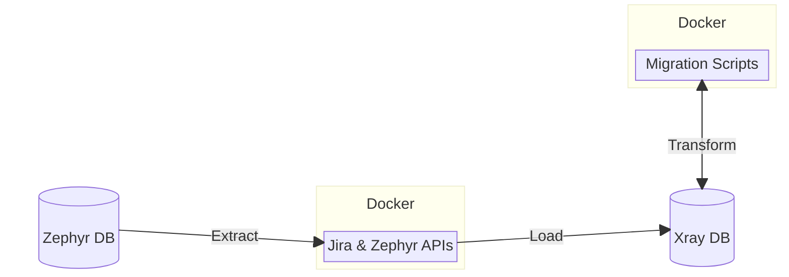
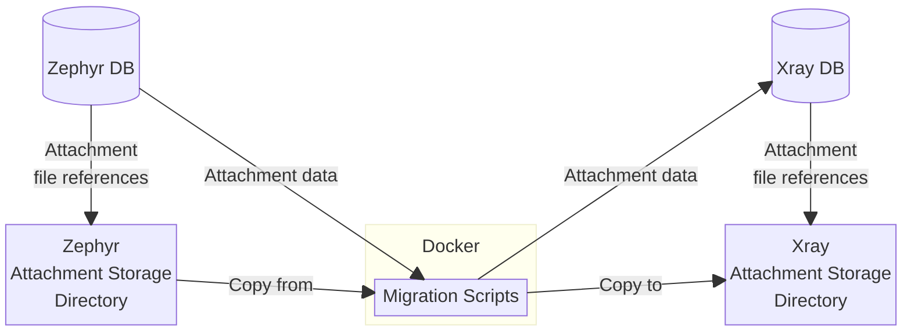

# Zephyr → Xray Migration

This repository contains configuration files and scripts to migrate data from [SmartBear Zephyr](https://smartbear.com/test-management/zephyr-scale/) to [Xray Test Management](https://www.getxray.app/). The migration occurs at the database level, retrieving data via the Jira and Zephyr APIs and writing directly into the Xray database. The migration ELT (Extract-Load-Transform) process uses [Docker](https://docker.com) containers and data transformation scripts, to move data from Zephyr to Xray.

The migration copies the specified Zephyr projects from a Jira instance to the same or different Jira instance.



## Migration Requirements & Pre-requisites

1. The Jira instances that are the source and the target of the migration must be already setup and running.
1. macOS or Linux are recommended for the computer running the migration. The migration automation bash scripts in this repository configure and execute the Docker-based migration tooling, and require a [Unix-like](https://en.wikipedia.org/wiki/Unix-like) operating system that is capable of running bash scripts.

> [!TIP]
> [Windows PowerShell](https://learn.microsoft.com/en-us/powershell/) with [Windows Subsystem for Linux (WSL)](https://learn.microsoft.com/en-us/windows/wsl/install) should suffice, if it is the only option, but it has not been tested.

3. Install [Git](https://git-scm.com/) on the computer running the migration.
1. Install [Docker](https://docs.docker.com/get-docker/) and docker-compose (which is included with [Docker Desktop](https://www.docker.com/products/docker-desktop/)) on the computer running the migration.
1. Allocate at least 16 gigabytes (GB) of RAM for running the Docker containers. The Docker default is 50% of the computer's RAM, so the default is sufficient on a computer with 32GB+ of RAM. You can adjust the amount of memory allocated to Docker from the [Docker Desktop settings](https://docs.docker.com/desktop/settings/mac/#advanced).

6. Verify that the computer running the migration has access to the Postgres database of the Jira instance that is the source of the migration. You will need:
  - the Jira database host
  - the [Postgres](https://www.postgresql.org/) port (e.g. `5432`)
  - the name of the Jira database (e.g. `jiradb`)
  - the Jira database username (e.g. `jira_user`)
  - the password for the Jira database user
7. Verify that the computer running the migration has access to the Postgres database of the Jira instance that is the target of the migration. You will need:
  - the Jira database host
  - the [Postgres](https://www.postgresql.org/) port (e.g. `5432`)
  - the name of the Jira database (e.g. `jiradb`)
  - the Jira database username (e.g. `jira_user`)
  - the password for the Jira database user
8. Ensure you have a spreadsheet application that is capable of viewing `.xlsx` files, such as MS Excel, Apple Numbers, Google Sheets, or LibreOffice.

### Attachment requirements



You will need to provide the path to the Xray attachment file storage locations, where attachment files will be copied during the migration.

During the migration process, the Zephyr attachment files will be copied to the Xray attachment storage location.

## Migration Usage

### Docker and GitHub repository preparation

1. Clone [this GitHub repository](https://github.com/Xray-App/xray-zephyr-migration) if you haven't already, with this command:

```console
git clone git@github.com:xray-app/xray-zephyr-migration

2. Log in to GitHub, and from [settings](https://github.com/settings/tokens), click "Generate new token" and generate a (classic) personal access token (PAT). You must provide a token name, such as `Xray migration`, an expiration, and the following scope:
  - `read:packages`

3. Click the green "Generate token" button.
1. Be sure to copy and save the personal access token once you've generated it.
1. Use the following command to log in to the [GitHub Container Registry](https://docs.github.com/en/packages/working-with-a-github-packages-registry/working-with-the-container-registry) (GHCR) with your username and the PAT you just generated:

```console
export GHCR_PAT=<insert personal access token here>
export GHCR_USER=<insert GitHub username here>
echo $GHCR_PAT | docker login ghcr.io -u $GHCR_USER --password-stdin
```

6. Look for the `Login Succeeded` message. Now that you are logged in, you'll be able to pull the `xray-zephyr-migration` image from GHCR, by following the steps in the next section.

### Container setup

1. Start the Docker container download and setup with the following commands:

```console
cd xray-zephyr-migration
./run.sh start
```

2. The script begins by pulling the `xray-zephyr-migration` image from the [GitHub Container Registry](https://docs.github.com/en/packages/working-with-a-github-packages-registry/working-with-the-container-registry) (GHCR).
1. Three new directories will be created in your local copy of this repository:
- `/config` - Contains configuration files for Zephyr and Xray.
- `/logs` - Log files generated by the migrations you run will be stored here.
- `/reports` - Any migration reconciliation reports you generate will be stored here.
7. If any of these directories already exist, they won't be modified by the script.
1. Once you see the messages `Starting...` and `xray-zephyr-migration`, the setup script is complete.
1. To check the status of the Xray Zephyr Docker container, run the following command:

```console
./run.sh status
```

10. The container should have a status of `running`. You are now ready to configure the migration.

### Migration configuration

Run the following command to configure settings for Zephyr and Xray:

```console
./run.sh configure
```

> [!TIP]
> Note: you can edit the Zephyr configuration directly by editing the `conn:` key of './config/zephyr/zephyr-config.yml'

Follow the steps below at each prompt to complete the configuration:

_Zephyr_

1. Enter the keys of the Zephyr projects to migrate, separated by commas (e.g. `PROJ-123,PROJ-456`).
1. Enter the domain of the Zephyr server, including the port if necessary (e.g. `https://your-zephyr-domain.com:8443`).
1. Enter the username to connect to the Zephyr server with. Leave this blank if you are using a bearer token for authentication.
1. Enter the password for the Zephyr server user. Leave this blank if you are using a bearer token for authentication.
1. Optionally enter the Zephyr bearer token to use for authentication, or press enter.

_Xray_

1. Enter the Xray database host URL (e.g. `https://your-xray-domain.com`).
1. Enter the Xray postgres database port (e.g. `5432`).
1. Enter the name of the Xray database (`jiradb` by default).
1. Enter the username to connect to the Jira server with (`jirauser` by default).
1. Enter the password for the Jira server user.
1. Enter the path to write the attachment files to (e.g. `/var/atlassian/application-data/jira/data/attachments/`)

Once done, you should see the message `Excellent, your Xray Zephyr Docker is now configured!`.

Next, check the [Xray config](./config/xray/xray-config.yml) and [Zephyr config](./config/zephyr/zephyr-config.yml) files for the updated settings. You can modify these files directly to make any needed changes.

For an in-depth explanation of the settings within the configuration files, refer to the [Xray](./Docs/xray-configuration.md) and [Zephyr](./Docs/zepyr-configuration.md) configuration documentation.

### Migration (Extract-Load)

1. Run the following command to create the project tables necessary for the migration to Xray:

```console
./run.sh retrieve
```

Enter 'retrieve' at the prompt to confirm that you're ready to create the project tables.

You should see the following tables created in Xray:
- rest_projects
- rest_testcases
- rest_testcycles
- rest_testruns
- rest_testplans
- rest_testcase_attachments
- rest_testcase_customfields
- rest_testplan_attachments
- rest_testplan_customfields
- rest_testcycle_attachments
- rest_testcycle_customfields
- rest_testrun_attachments
- rest_testcase_comments

Once you see the messages `Zephyr test cycle additional attachments retrieval script completed.` and `Zephyr retrieval complete!`, the retrieval process is complete.

1. Run the following command to start the migration:

```console
./run.sh migrate
```

Enter 'migrate' at the prompt to confirm that you're ready to migrate the data.

This script will extract data from the Zephyr database and load it into the Xray database.

You should see the following messages when the migration is complete:
- `Zephyr migration complete!`
- Please restart your Jira server and perform a re-index from the System settings panel for the changes to take effect.

The second of those messages mentions the steps outlined in the next section.

### Restart and re-index Jira server

1. To see the changes from the migration take effect, you must first restart your Jira server. You can do this by connecting to the server via SSH and running `service jira restart` with a user that has sufficient permissions, or by restarting the Docker container running the Jira server.
1. Once the Jira server is restarted, log in via the web browser and navigate to settings by clicking the gear icon in the top right corner and selecting "System" from the dropdown menu.
1. Scroll to the "Advanced" section in the left sidebar, and click "Indexing".
1. Select the "Full re-index" option, and click the "Re-index" button.
1. Click "Re-index" in the confirmation dialog to begin reindexing.
1. Once the progress bar reaches 100% and you see the message "Re-indexing is 100% complete," check that the migration has taken effect by navigating to the migrated Zephyr project in the web UI from the Projects tab at the top of the page.

### Reconciliation reporting

1. To generate a migration reconciliation report showing the data that was migrated from Zephyr to Xray (and the data that wasn't migrated), run the following command:

```console
./run.sh report
```

2. The script will output a spreadsheet in the `/reports` directory, showing the reconciliation of data between Zephyr and Xray. A command to open the report will be displayed in the console (e.g. `open ./reports/xray-report-2024-06-28T15:00:00Z.xlsx`). The command will open the report in your default spreadsheet application.

## Additional Information

### Start and setup script

You can run the both the setup and migration scripts at once with the following command:

```console
./run.sh go
```

### Cleaning migrated data

> [!WARNING]
> Cleaning migrated data means removing all the data that was copied to Xray as a result of running the migration. Only perform this step if you want to "rollback" the migration and remove the migrated data.

1. After you've run the migration scripts, you may choose to remove the migrated data from the Xray database. To do this, run the following command:

```console
./run.sh clean
```

2. Enter `clean` at the prompt to confirm that you're ready to remove the migrated data from Xray.
1. Once confirmed, the script will remove the migrated data from the Xray database. No data that already existed in Xray separately from the migration will be removed.

### Cleaning retrieved data

> [!CAUTION]
> Cleaning retrieved data means removing all the data that was extracted from Zephyr and loaded into the Xray database. This data contains a ledger record of the resulting transformation and migration of the data into the Xray tables. If you remove the retrieved data you will no longer be able to use this ledger record to clean the migrated data from Xray in a migration "rollback".

1. Once you've cleaned the migrated data from Xray, you may want to remove the Zephyr tables that were created during the Zephyr migration. To do this, run the following command:

```console
./run.sh clean-rest
```

2. Enter `clean` at the prompt to confirm that you're ready to remove the Zephyr tables from the Xray database.
1. Once confirmed, the script will remove the Zephyr tables from the Xray database.

### Stopping the Docker containers

When you have completed the migration, you will want to stop the migration's Docker containers.

To bring down the Docker containers, run the following command:

```console
./run.sh stop
```

This will not remove the containers or their data.

### Removing the Docker containers

To remove the Docker containers and reset to the initial state, run the following:

```console
./run.sh reset
```

Enter `y` for yes at the prompt to confirm that you want to reset the container.

This command will stop and remove the container, and remove the following directories and their contents:
- `/config`
- `/logs`
- `/reports`

### Additional commands

You can see a full list of available commands by running:

```bash
./run.sh help
```

Some seldom-needed [additional commands](./Docs/additional-commands.md) are available.

In some rare circumstances, it may be helpful to [run individual data transformation jobs](./Docs/direct-launchers.md).
